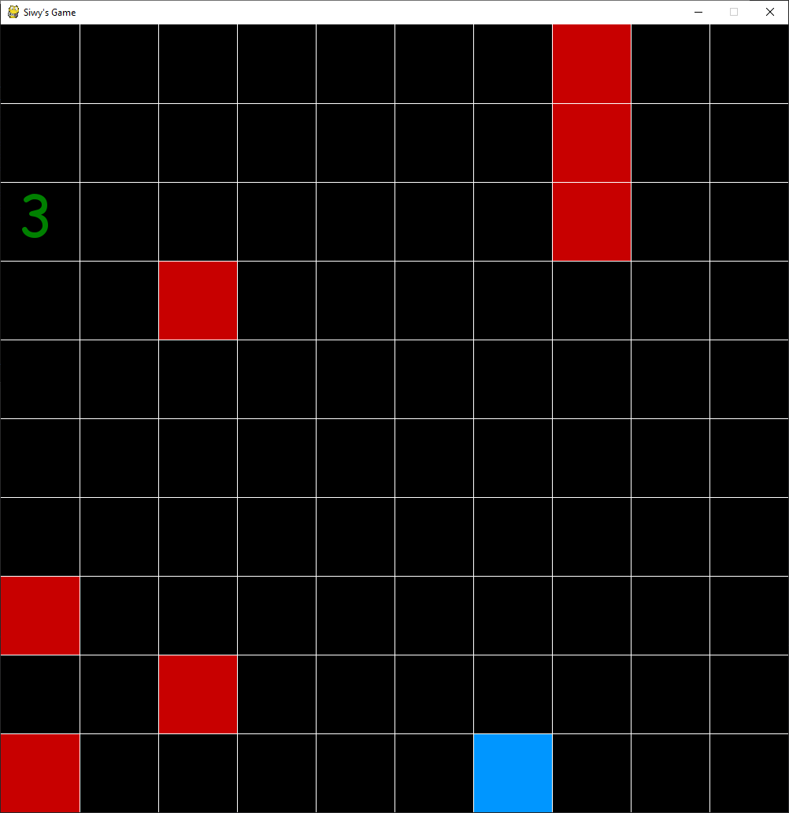
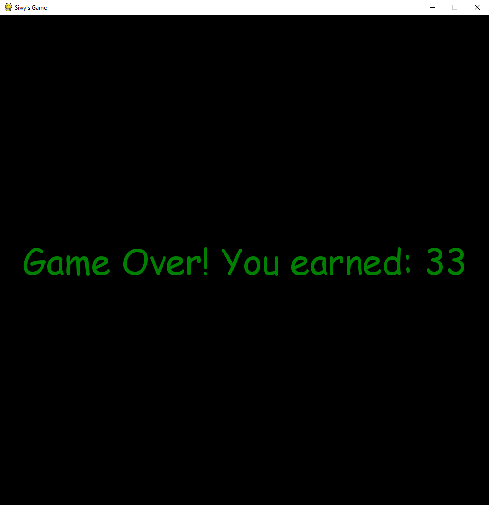
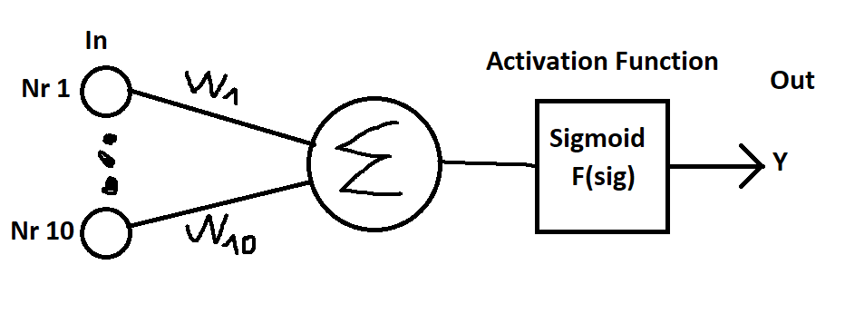

# Self Playing Game
Simple 2D game logic with simple perceptron neural network for learning current look of the game board

## The appearance of the game

Appearance during playing

Score appearance after game loss by AI gamer

Sample appearance is described above
 

## The Neural Network schema
Simple representation created by MS Paint to imagine perceptron schema

